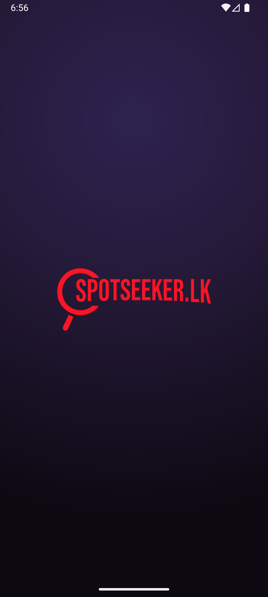
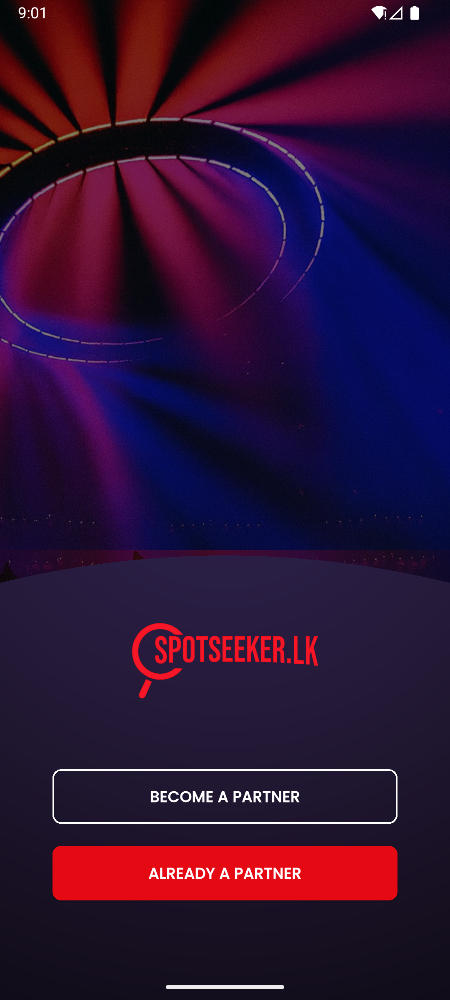
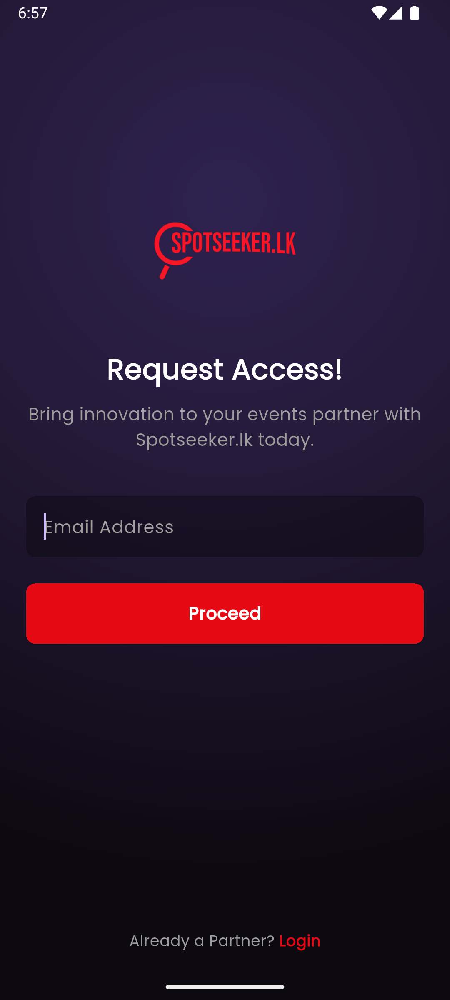
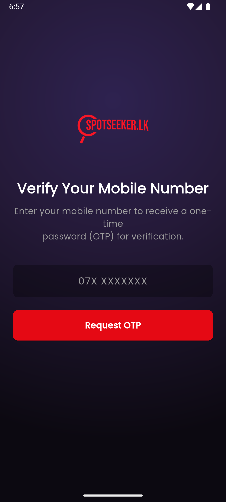
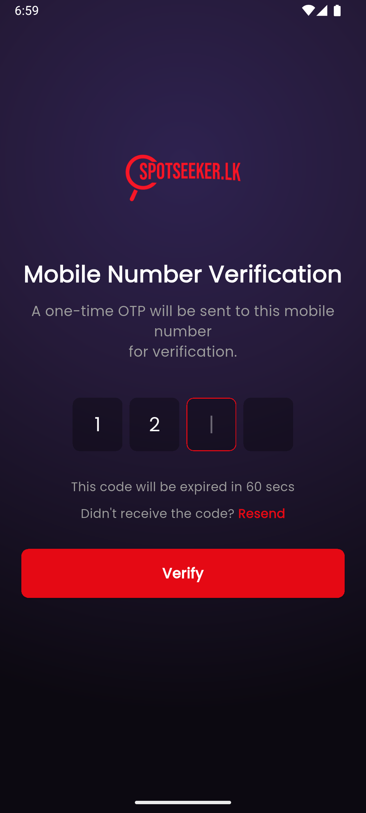
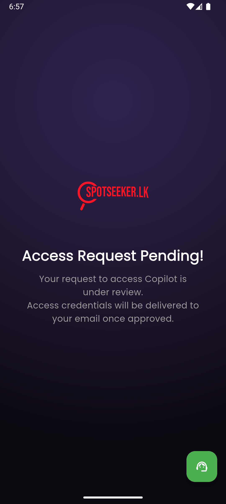
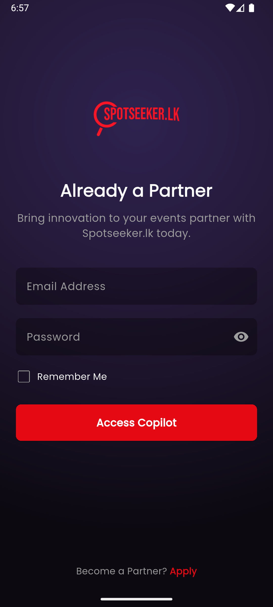
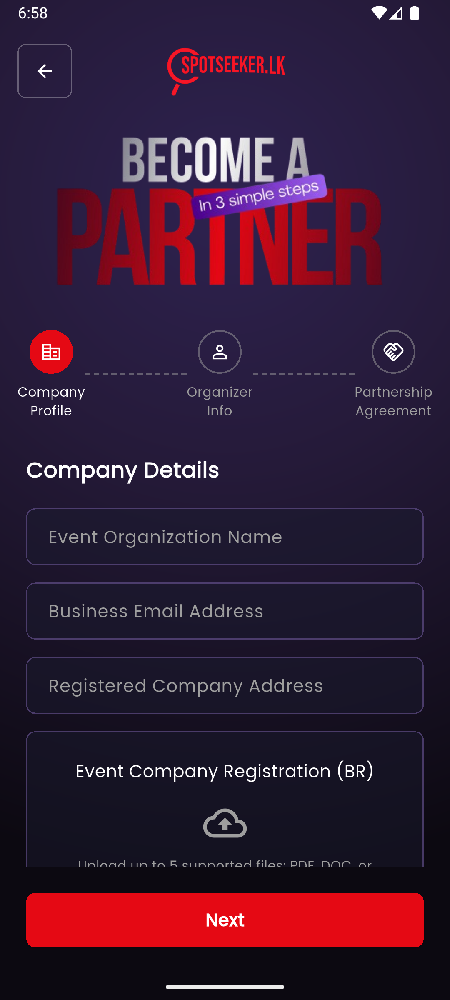
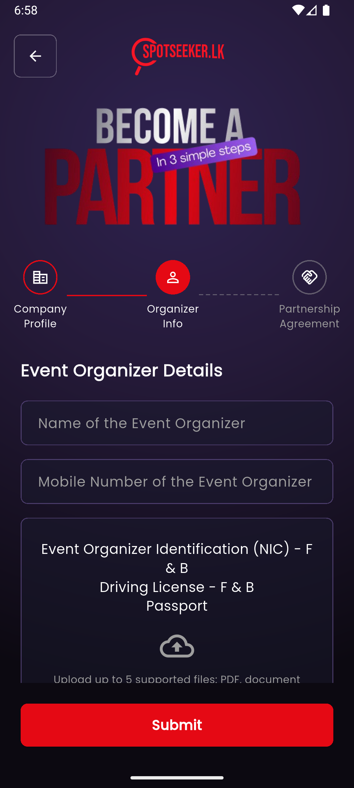
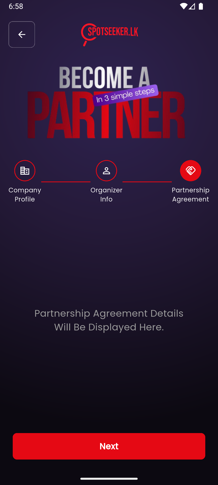

# Spotseeker UI Demo


## Screenshots

| Splash Screen | Welcome / Landing | Become a Partner |
|:-------------:|:-----------------:|:----------------:|
|  |  |  |

| Verify Mobile Number | OTP Verification | Access Request Pending |
|:-------------------:|:----------------:|:---------------------:|
|  |  |  |

| Partner Login | Partner Form: Company Profile | Partner Form: Organizer Info |
|:-------------:|:----------------------------:|:----------------------------:|
|  |  |  |

| Partner Form: Agreement |
|:----------------------:|
|  |


## Run
1. Ensure Flutter SDK is installed.
2. From project root:
	```bash
	flutter pub get
	flutter run
	```

Open in Android Studio or VS Code and run on an emulator or device.
